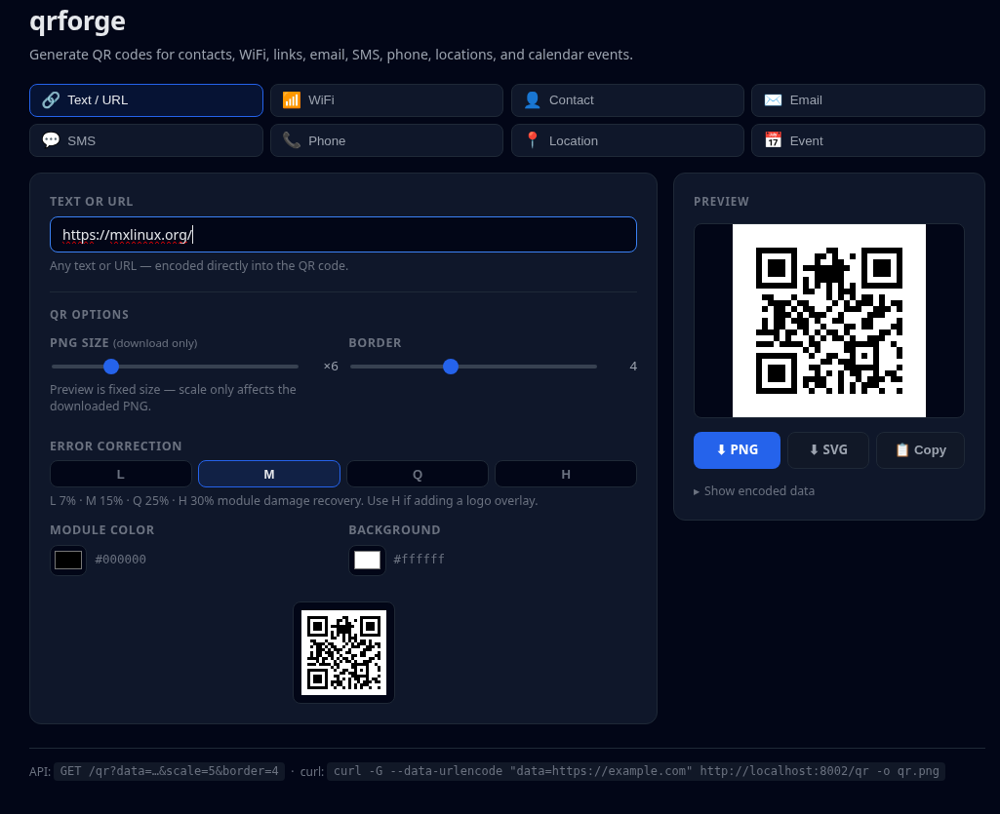

# ⚡  qr-forge




### Self-hosted QR code generator — contacts, WiFi, email, SMS, phone, locations, events & more

Generate QR codes for 8 real-world use cases via a FastAPI backend, Debian-slim Docker image, and a responsive dark two-column web UI. Live preview, SVG + PNG export, error correction control, and custom colors — no external dependencies, no third-party services.

---

# ✨ Features

```
▸ 8 QR modes    → Text/URL · WiFi · Contact · Email · SMS · Phone · Location · Event
▸ Live preview  → QR updates as you type — no submit button
▸ SVG + PNG     → Download both formats; smart filenames per mode
▸ Error correction → L / M / Q / H (default M — use H for logo overlays)
▸ Custom colors → Module color + background color pickers
▸ MeCard        → Compact contact format natively recognized by iOS Camera
▸ Geo mode      → "Use my location" button + optional label
▸ Event mode    → Calendar event (VEVENT) with pre-filled start/end times
▸ Mini preview  → Inline QR thumbnail in QR Options — visible while adjusting
▸ /qr API       → PNG or SVG endpoint usable from curl, scripts, or any HTTP client
▸ Zero disk I/O → All QR codes generated in-memory
▸ Bind-mount    → Edit code without rebuilding the container
```

---

# 🧩 Architecture Overview

```
qrforge
│
├── app/
│   ├── main.py         # FastAPI server — / and /qr endpoints
│   ├── __init__.py
│   └── templates/
│       └── index.html  # Dark UI — all payload building in client-side JS
│
├── Dockerfile          # python:3.12-slim-bookworm base
├── docker-compose.yml  # Bind-mount, port 8002, restart unless-stopped
├── requirements.txt
└── README.md
```

---

# 🚀 Quick Start — docker compose (recommended)

### Start the stack
```bash
docker compose up --build --detach
```

### Check status
```bash
docker compose ps
```

### Open the UI
```
http://localhost:8002/
```

### Stop the service
```bash
docker compose down
```

> **Live reload:** the compose file bind-mounts `./app` into the container.
> Editing `main.py` or `index.html` takes effect immediately — no rebuild needed.
> Only rebuild if `requirements.txt` or `Dockerfile` changes.

---

# 🚀 Quick Start — docker run

### Build
```bash
docker build --tag qrforge:2.1.0 .
```

### Run
```bash
docker run --rm --name qrforge --publish 8002:8002 qrforge:2.1.0
```

### Visit
```
http://localhost:8002/
```

### Stop
```bash
docker stop qrforge
```

---

# 🎨 UI Modes

Select a mode from the grid — the form updates instantly. QR preview refreshes as you type.

| Mode | Encodes | Scanned action |
|---|---|---|
| **Text / URL** | Any string or URL | Opens URL / displays text |
| **WiFi** | WPA/WPA2/WEP/nopass + hidden flag | Joins the network |
| **Contact (vCard)** | Full vCard 3.0 — name, org, title, phones, email, URL, address, note | Prompts "Add Contact" |
| **Contact (MeCard)** | Compact MeCard — same fields minus title | Prompts "Add Contact" (iOS Camera native) |
| **Email** | `mailto:` with To / Subject / Body | Opens email app pre-filled |
| **SMS** | `smsto:` with number + message | Opens SMS app pre-filled |
| **Phone** | `tel:` number | Opens dialer |
| **Location** | `geo:` lat/lng + optional label | Opens Maps |
| **Event** | VEVENT — title, start, end, location, description | Offers to add to calendar |

---

# 📡 API Reference — GET /qr

All parameters are query string values.

| Parameter | Required | Default | Description |
|---|---|---|---|
| `data` | ✅ | — | String to encode |
| `scale` | | `6` | PNG scale factor (1–50). Each module is `scale` pixels wide. |
| `border` | | `4` | Quiet-zone width in modules (0–20) |
| `ec` | | `M` | Error correction: `L` 7% · `M` 15% · `Q` 25% · `H` 30% |
| `dark` | | `#000000` | Module color — hex (`#ff0000`) or CSS name (`darkred`) |
| `light` | | `#ffffff` | Background color — hex or CSS name |
| `fmt` | | `png` | Output format: `png` or `svg` |

### Text / URL
```bash
curl -G --data-urlencode "data=https://example.com" \
  http://localhost:8002/qr --output qr.png
```

### Custom size and error correction
```bash
curl -G --data-urlencode "data=Hello" \
  --data "scale=12&border=2&ec=H" \
  http://localhost:8002/qr --output qr_large.png
```

### Custom colors (red on black)
```bash
curl -G --data-urlencode "data=https://example.com" \
  --data "dark=%23ff0000&light=%23000000" \
  http://localhost:8002/qr --output qr_red.png
```

### SVG output (vector, print-ready)
```bash
curl -G --data-urlencode "data=https://example.com" \
  --data "fmt=svg" \
  http://localhost:8002/qr --output qr.svg
```

### WiFi QR (programmatic)
```bash
curl -G --data-urlencode "data=WIFI:T:WPA;S:MyNetwork;P:MyPass;H:false;;" \
  http://localhost:8002/qr --output wifi.png
```

### vCard QR (programmatic)
```bash
DATA="BEGIN:VCARD
VERSION:3.0
N:Smith;Jane;;;
FN:Jane Smith
TEL;TYPE=CELL:+15550000000
EMAIL:jane@example.com
END:VCARD"

curl -G --data-urlencode "data=${DATA}" \
  http://localhost:8002/qr --output contact.png
```

---

# 🧠 Internals

### Stack
```
FastAPI   → Routing, HTML rendering, input validation
segno     → QR generation (PNG + SVG, all error correction levels, custom colors)
Jinja2    → HTML templating
uvicorn   → ASGI server
```

### Request flow
```
Browser  →  GET /           →  Jinja2 renders index.html
JS       →  builds payload  →  GET /qr?data=...&ec=M&dark=#000&fmt=png
segno    →  generates QR    →  in-memory BytesIO
FastAPI  →  returns bytes   →  image/png or image/svg+xml
```

Zero disk writes. Zero temp files. All QR generation is in-memory.

### Payload building
All mode payloads (vCard, WiFi, VEVENT, `mailto:`, `smsto:`, `tel:`, `geo:`) are built client-side in JavaScript. The `/qr` endpoint is format-agnostic — it encodes whatever string you pass.

---

# ⚙️ Config

### Default port
```
8002
```

### Change port
Edit `ports` in `docker-compose.yml` and the `--port` flag in `Dockerfile CMD`, then rebuild.

### Environment variables
```
QRFORGE_ENV   → "production" (set in docker-compose.yml)
```

---

# ☁️ Cloud Deployment

### VM (any Linux)
```bash
docker compose up --build --detach
```
Expose port `8002` via your firewall / reverse proxy.

### Behind a reverse proxy (nginx / Caddy)
Proxy `localhost:8002` — the app is stateless and needs no sticky sessions.

### Managed container platforms
```
Build → Push to registry → Deploy → Map port 8002 → Done
```

Stateless — horizontally scalable with no shared state.

---

# 📊 Logs

```bash
docker compose logs -f qrforge
docker logs qrforge
```

---

# 🛠 Troubleshooting

### Service not starting
```bash
docker compose logs qrforge
```

### Nothing at :8002
```bash
docker compose ps
```

### QR won't scan
Increase error correction: use `ec=Q` or `ec=H`. Ensure sufficient contrast between module and background colors.

### QR too dense / small
Increase scale: `scale=12` or higher. For large-format print, use `fmt=svg` — infinitely scalable.

### Color changes not visible
Ensure `dark` and `light` colors have sufficient contrast. Black on white (`#000000` / `#ffffff`) is the most universally scannable combination.

---

# 🔧 Dev Workflow

The bind mount means you can edit files and see changes instantly:

```bash
# Start once
docker compose up --build --detach

# Edit app/main.py or app/templates/index.html
# Changes are live immediately — no restart needed

# View logs
docker compose logs -f qrforge
```

Feature branches:
```bash
git checkout -b feature/your-feature
```

Rebuild only when dependencies change:
```bash
docker compose up --build --detach
```

---

# 🏷️ Possible Enhancements

- 🔒 Optional password protection / API key auth
- 📈 Health endpoint (`/health`)
- 📜 Session QR history
- 🖨️ Batch generation (CSV → multiple QR codes)
- 🖼️ Logo overlay (segno plugin support)
- 🌐 Docker Hub automated builds

---

# ⚠️ License

This work is licensed under the GNU General Public License version 3. See `LICENSE`.

---

# ⚠️ Disclaimer

Software is provided **AS-IS**.
Production security posture is **your** responsibility.

---

### Keywords

qr, qr code, qr-code, qr-generator, qr code generator, self-hosted qr,
vcard qr, contact qr, mecard qr, wifi qr, wifi-qr, wifi password qr, wpa qr,
email qr, sms qr, phone qr, geo qr, location qr, calendar qr, vevent qr,
svg qr code, custom color qr, branded qr code, error correction qr,
fastapi qr, docker qr, debian qr, segno, python qr generator,
local-first qr service, web qr generator, self-hosted qr code generator
